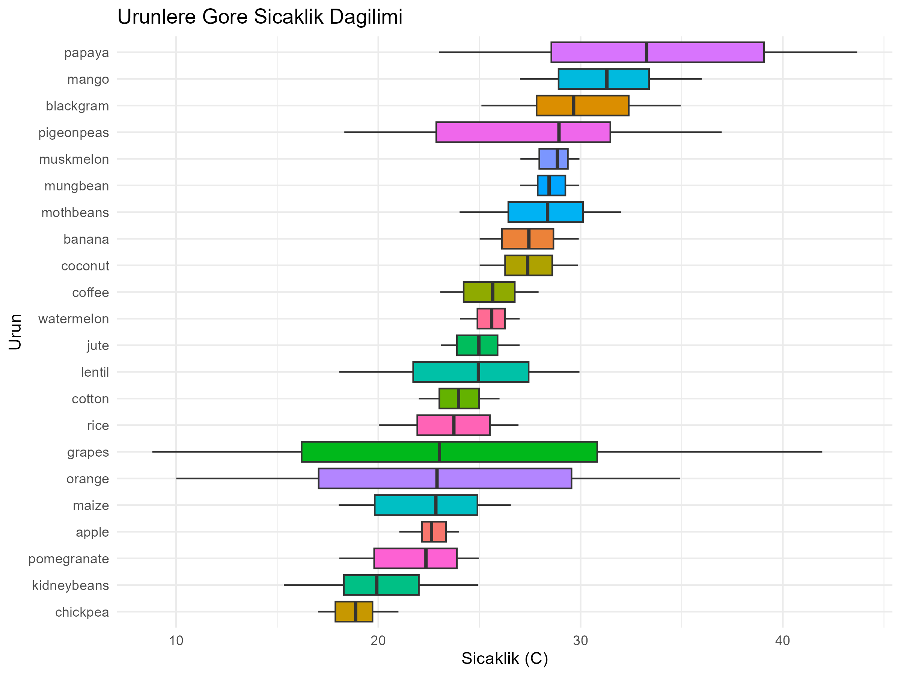
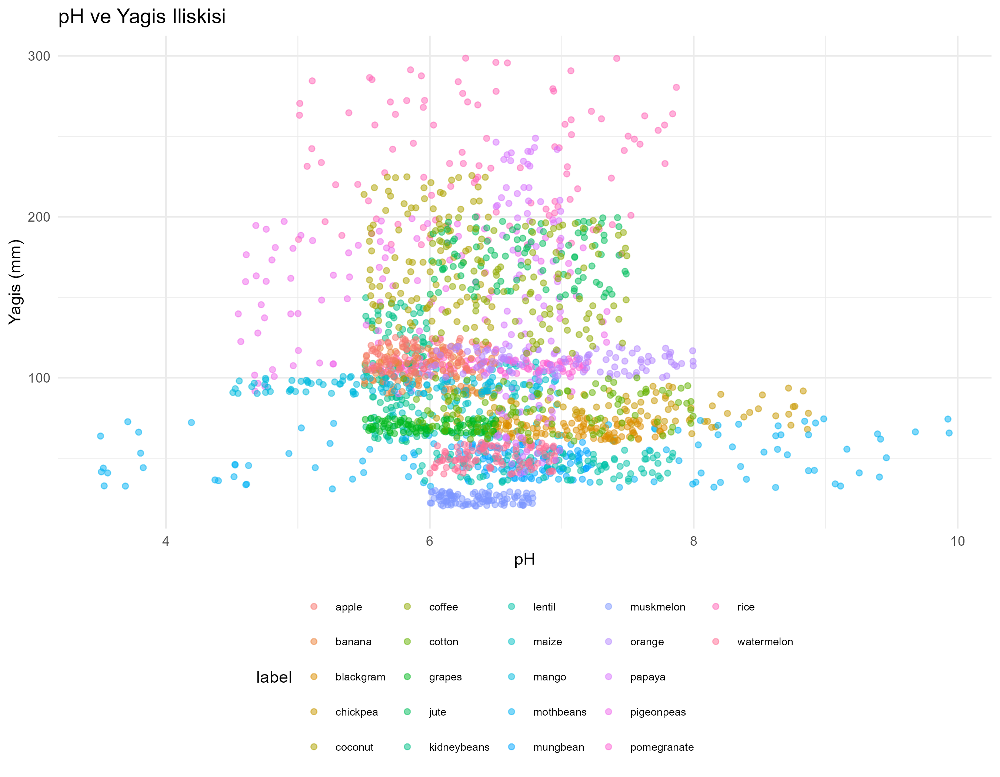

# 🌾 Crop Recommendation Analysis

Bu proje, tarımsal koşullara göre hangi ürünün ekileceğini tahmin etmek amacıyla
yapılmış bir veri analizi ve makine öğrenmesi çalışmasıdır.

## 🎯 Proje Amacı
Toprak özellikleri (N, P, K, pH) ve iklim verileri (sıcaklık, nem, yağış) kullanılarak
22 farklı tarım ürünü için öneri sistemi geliştirilmiştir.

## 🛠️ Kullanılan Araçlar
- R 4.5
- ggplot2 (görselleştirme)
- tidyverse (veri manipülasyonu)
- randomForest (makine öğrenmesi)
- caret (model değerlendirme)

## 📁 Proje Yapısı
crop-recommendation-analysis/
├── data/        # Ham veri (Kaggle'dan indirildi)
├── scripts/     # R analiz kodları
├── output/      # Grafikler ve sonuçlar
└── README.md

## 📊 Analizler
- Keşifsel Veri Analizi (EDA)
- Ürün bazında sıcaklık ve nem dağılımları
- pH ve yağış ilişkisi
- Random Forest sınıflandırma modeli

## 📈 Örnek Görselleştirmeler

### Ürünlere Göre Sıcaklık Dağılımı

### pH ve Yağış İlişkisi

## 🔗 Veri Kaynağı
[Crop Recommendation Dataset - Kaggle](https://www.kaggle.com/datasets/atharvaingle/crop-recommendation-dataset)
